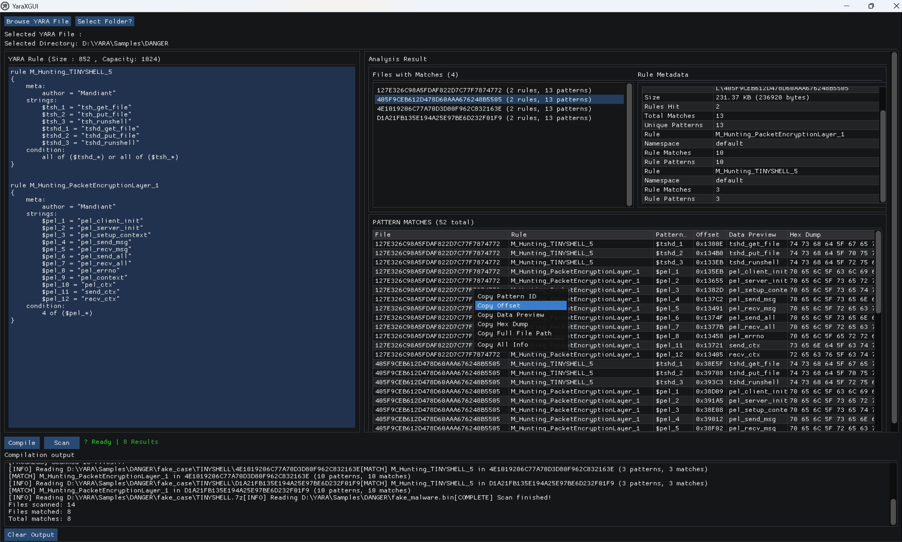

# YaraXGUI
This contains the release of YaraXGUI which gives a graphical view of Yara-x. I foresee myself doing more YARA rule writings and therefore, it might be a good time to learn more about ImGUI as well.

# Video Demo

Can watch from this [link](https://youtu.be/RYoayoBdKNQ)

## Usage

### YARA Rule Input
You can either:
- browser for YARA rule (.yara or .yar) files OR
- edit YARA rule right in the editor

### Scan Directory
- Select the browser that you want to scan recursively

### Compile YARA
- Compile the YARA rule which should indicate success or error

### Scan
- Once compilation is successful, we can now scan directory which should display more information

### Rule Metadata
These are information about the file which include:
- File name
- Size of the file
- information about the YARA matches

### Files with Matches Indications
This includes number of rules and number of patterns hit during the match

### Pattern Matches
This maps the file to the rule that was hit along with the actual data that were matched from the files.

# Demo

