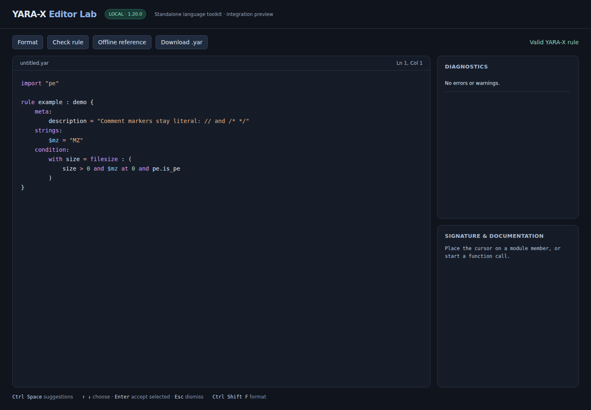

# Validation report

Current requirement: **Python 3.13 or newer**, with **YARA-X 1.20.0**.
The module remains independently packaged; YaraXGUI integrates it through
Qt and headless adapters.

The results below are a historical record of earlier Linux x86-64 validation.
The [machine-readable report](validation-report.json) retains the original
interpreter version and results. Current CI uses Python 3.13; see
[Development](../../../docs/DEVELOPMENT.md#github-actions) for the active checks.

| Check | Result |
|---|---|
| Package test suite | **2,502 passed**, no failures, errors or skips |
| Real Chromium editor interactions | **8 passed**, no page errors |
| Existing YaraXGUI regression suite | **154 passed**; two dependency deprecation warnings |
| Standalone wheel + source archive | Built successfully |
| Wheel installed outside the repository | Passed, with only YARA-X as a runtime dependency |
| Bundled original references | 661 files verified against manifest SHA-256 checksums |
| Module/function catalog | Catalog checksum verified; 21 definitions, 131 overloads, 16 numeric builtins, 40 keywords |

The [machine-readable report](validation-report.json) includes the suite breakdown
and environment. Hypothesis additionally exercises 300 arbitrary Unicode inputs,
120 incomplete edit strings and 100 generated boolean-expression/matching cases.
Those examples run inside the reported test cases, not as separately inflated test counts.

## What was checked

- The bundled upstream parser, compiler and formatter inputs are tokenized losslessly.
  Their acceptance/rejection is compared with direct YARA-X compilation. Valid inputs
  are formatted, recompiled, formatted a second time, and scanned before/after against
  empty, text/null/non-ASCII and all-byte-value samples. Rule names, tags, metadata and
  pattern identifiers are compared as well.
- Generated field paths, array/map accesses, constant namespaces, exported overloads,
  receiver methods and numeric builtins are checked against the actual compiler.
  Restricted or parser-inaccessible fields are tested for rejection, not silently skipped.
- Literal/comment contents and token identity must survive formatting. Additional cases
  cover LF/CRLF, multiline metadata, regex escapes, hex comments, nested/sequential `with`,
  loops, modern numbers, explicit includes and external globals.
- Editing tests cover exact-token dismissal, suffix replacement, non-code suppression,
  local scope, module availability, loop/alias/global member suggestions, signature
  overloads, definitions, references, folding, snippets/mirrors, undo/redo, atomic edits,
  UTF-8/UTF-16 conversions and stale-response invalidation.
- Chromium tests exercise live diagnostics, Unicode selection ranges, actual rendered
  colours, formatting, offline documentation search, nested member suggestions, snippet
  acceptance/mirrors, signature help and a deliberately delayed completion after Escape.
- A regression test forces compiler errors on worker threads and garbage collection on
  another thread. This protects against retaining an unsendable PyO3 compiler in an
  exception traceback cycle.
- A fresh virtual environment installed the wheel from `/tmp`, imported it with Python
  isolation enabled, checked all original reference checksums, formatted/compiled/matched
  a `with` rule, and requested nested PE completions. Neither yaraast nor Qt was installed.

## Network binding follow-up

After adding configurable IPv4 binding (default `0.0.0.0`), the focused CLI,
HTTP and Chromium suites passed **19 tests**. These cover the default and
loopback override, page access, same-origin compilation using IP/localhost,
rejection of foreign hosts/origins and wrong ports, and existing browser editor
interactions. The full-suite figures above include the subsequent formatting limits change.

Live page and compilation requests also passed through loopback, LAN and VPN
interface addresses from the server itself. Access from a separate machine was
not tested.

## Formatting and large-file follow-up

The complete standalone and Chromium suites passed **2,509 tests** in 86.14 seconds.
New tests cover a 2,000-rule input, UTF-8 byte boundaries, external globals and
worker diagnostics, simultaneous requests, cooldown recovery, forced worker timeout
and termination, worker crashes, HTTP error statuses, large-file manual controls,
Unicode oversize refusal, download, repeated shortcuts and stale success/error replies.
An editor status regression found while typing during formatting was corrected.
The LAN endpoint also formatted a `with` rule and rejected oversized source.

## Performance observations

One run on this machine measured approximately **19 ms cold / 2 ms warm** for completion
in 100 short rules, and **138 ms cold / 23 ms warm** in 1,000 rules (about 27 KB).
Unchanged source reuses bounded lexer/index caches. These are observations, not portable
latency guarantees; larger documents still require work on edits, so UI adapters should
debounce requests and discard stale results as the playground does.

## Boundaries

This is extensive regression evidence, not a mathematical proof of correctness or
a compatibility claim for future engines. Windows/macOS wheels, hosted VirusTotal
features and arbitrary custom module builds were not exercised here. The precise
version, restrictions and editor-inference boundaries are in
[COMPATIBILITY.md](COMPATIBILITY.md).

## Desktop and API integration

The updated module suite passed **2,510 tests** (2,502 package and 8 Chromium)
in 89.98 seconds. YaraXGUI passed **154 tests**, including included-file diagnostics,
Qt worker scheduling, linked snippets, formatting undo, stale replies, Unicode
budgets and API responsiveness. See [INTEGRATION.md](INTEGRATION.md) for adapters
and deployment checks.
